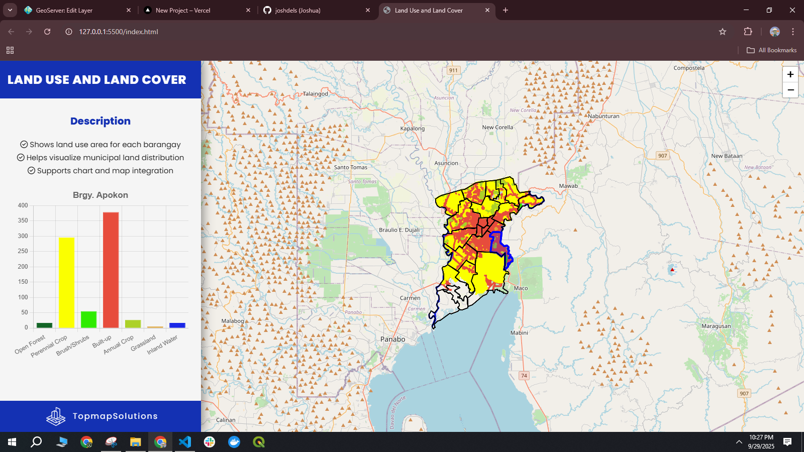
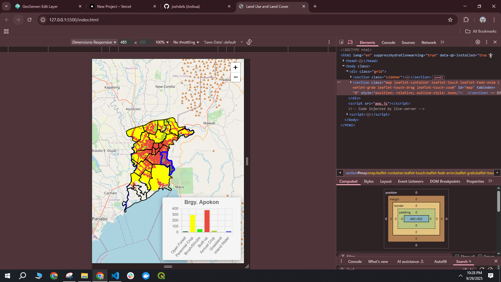

# Municipality's Land Cover Statistics

### Description
This calculates the land cover area and shows it in a chart
view it here https://landuseandlandcover.vercel.app/

### Image

### Tech used
1. Geoserver
2. PostGIS
3. Leaflet
4. Docker
5. CSS Grid

### How it works
1. Shapefile are cleaned and store inside the postgres sent to geoserver
2. It is dockered and deployed to VPS
3. Fetch the geoserver WFS to view in the leaflet html
4. CSS Grids for phoneview  
